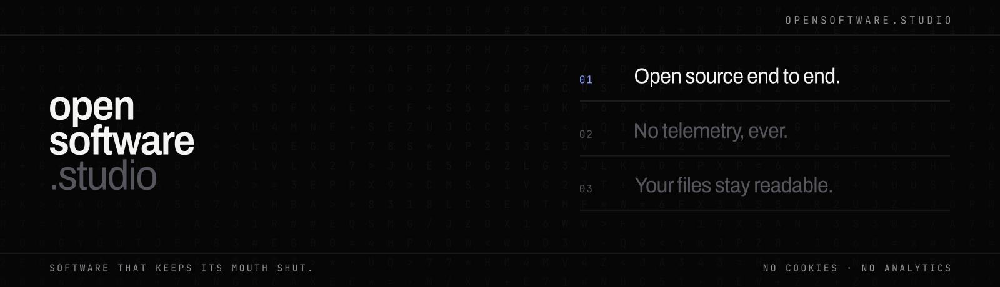

<h3 align="center">Software that keeps its mouth shut.</h3>

  Open in the light, private by default. 
  <a href="https://opensoftware.studio">opensoftware.studio</a> ·
  <a href="https://myne.md">work 001 · myne</a> ·
  <a href="https://github.com/myne-md">the source</a>

---

We build tools that do not phone home, do not rent themselves back to you, and
do not hold your files hostage. Neither openness nor privacy is a setting you
have to go and find — it is what the software is.

## The works

A studio, not a product company. Every work is held to the same list.

### 001 — myne

**Encrypted markdown notes.** The only open-source notes app where your files
stay plain markdown after decryption, where backlinks and graph are first-class,
where signup takes no email, and where the same code runs on our sync or on your
own server.

[Download](https://myne.md/download) · [Read the source](https://github.com/myne-md) · [myne.md](https://myne.md)

> *The rest are being built to the same standard — and if we ever break it, the
> source is public and you will be able to say so.*

## The standard

Every work in this studio is held to the same list. It is not a roadmap; it is a
filter.

1. **Open source end to end** — client, server, protocol, build pipeline. There is no better build behind a door.
2. **No telemetry.** Not in any build, not ever, not even in aggregate.
3. **Nothing leaves your device** unless you named where it goes.
4. **No proprietary format.** Your files stay readable without us.
5. **Self-hostable, or it does not ship.**
6. **No email at signup.** No email recovery.
7. **No payment for what already runs on your own machine.**
8. **No venture capital.** No acquisition as an exit.

## The manifesto

**Privacy is not a feature we sell. It is the thing itself.**
There is no premium tier where the encryption gets better. No telemetry waiting
for you to find the switch. No account we ask you to make so we can count you.

**We say what our software cannot do as loudly as what it can.**
If losing your password means losing your notes, you hear it before you type the
first one — not in a help article afterwards. A studio that is honest only about
its strengths is selling something.

**Every work here is built so that leaving is easy.**
Your files are yours, in a format you already read. The server is something you
can run yourself. Stop trusting us and self-host. Stop using us and walk away
with everything.

**We take no venture capital, and we are not building toward a sale.**
A privacy company that raises money against a growth promise makes a trade it
cannot unwind: eventually the data pays for it. We would rather be small, slow,
and still here in ten years.

**Beauty is not decoration. It is respect.**
Software that looks like an afterthought treats its user like one. Every surface
here is drawn rather than assembled, because a tool you live inside for hours
owes you something worth looking at.

## In this organisation

| repository | what it is |
|---|---|
| [`website`](https://github.com/Open-Software-Studio/website) | the studio's single page |
| [`branding`](https://github.com/Open-Software-Studio/branding) | the mark, the palette, the type — all generated from one source |

No cookies. No analytics. No third-party requests.
